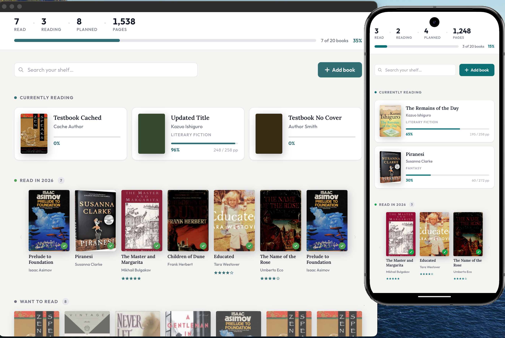

# Holebooks

A personal reading tracker. Track what you're reading, what you've read, and what you want to read next — with book cover art, progress tracking, and star ratings.



Built with [SvelteKit](https://svelte.dev/docs/kit) on the [Bare](https://github.com/holepunchto/bare) runtime, packaged as a native desktop and Android app via [`sveltekit-adapter-bare`](https://github.com/holepunchto/sveltekit-adapter-bare).

## Features

- Search and add books via Open Library
- Track reading status: Want to Read, Reading, Read
- Progress tracking with page counts
- Star ratings and read dates
- Book cover art cached locally with HyperDB
- Works on macOS and Android

## Stack

- **SvelteKit** — UI and routing
- **sveltekit-adapter-bare** — packages the app for the Bare runtime
- **HyperDB** — local persistent storage (hyperbee2 backend)
- **bare-native** — native window and WebView
- **bare-http1** — local HTTP server

## Development

```sh
npm install
npm run dev
```

Opens a browser dev server at `http://localhost:5173`.

## Build

```sh
# 1. SvelteKit build — emits ./build
npm run build

# 2. Package for the target platform
npx bare-build \
  --out build/darwin-arm64 \
  --host darwin-arm64 \
  --runtime bare-native/runtime \
  build/index.js
```

Swap `--host` / `--out` for other targets (`linux-x64`, `android-arm64`, etc.).

## License

Apache-2.0
